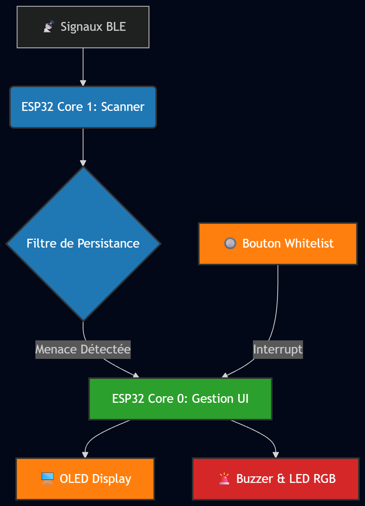
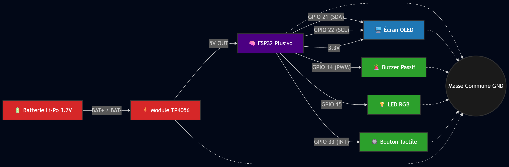

# Scanner Anti-Harcèlement (Détecteur de traceurs BLE)

| Author | Bianca Dan |
| :--- | :--- |

## Description
Ce projet est un système de contre-surveillance portable conçu pour détecter les signaux Bluetooth Low Energy (BLE) cachés (ex: Apple AirTags). L'accent principal de ce projet relève de l'Ingénierie de l'Information (Information Engineering) : concevoir une architecture logicielle hautement optimisée pour un système embarqué contraint. L'algorithme utilise un traitement asynchrone non-bloquant, exploitant les deux cœurs de l'ESP32 (Core 0 pour le rendu de l'interface utilisateur I2C, Core 1 pour le balayage radio BLE). Une gestion stricte de la mémoire est implémentée pour traiter des milliers de paquets publicitaires en temps réel sans provoquer de fuites de mémoire (memory leaks) dans des environnements urbains denses.

## Architecture du système

<pre>
[ SIGNAUX BLE ] 
       │
       ▼
[ ESP32 (Cerveau) ] ─── Core 1: Scan Radio Passif (Asynchrone)
       │            ─── Core 0: Gestion UI & Interruptions
       │
       ├──→ [Écran OLED I2C]
       │         Affichage des adresses MAC & Niveau de menace
       │
       ├──→ [Buzzer PWM + LED RGB]
       │         Alertes sonores et visuelles (RSSI)
       │
       ├──← [Bouton Tactile]
       │         Interruption : Mise en liste blanche (Whitelist)
       │
       └──→ [Batterie Li-Po + TP4056]
                 Gestion de l'énergie et autonomie portable
</pre>

## Motivation
L'essor des traceurs Bluetooth commerciaux a créé de nouvelles vulnérabilités en matière de vie privée. Bien qu'il s'agisse d'un dispositif matériel, le véritable défi réside dans l'architecture des données : comment capturer, filtrer et analyser un flux constant d'adresses MAC dynamiques en temps réel pour déterminer si une adresse spécifique est "persistante" (suivi) ou simplement "de passage". Ce projet vise à résoudre ce problème de traitement de l'information en développant une structure de données optimisée et une interface réactive (I2C OLED, signaux PWM) fonctionnant indépendamment des écosystèmes de smartphones.

## Architecture
Le système est structuré autour du traitement efficace des données :

L'unité centrale (**ESP32**) gère les interruptions matérielles (Hardware Interrupts) et les timers système (`millis()`) pour maintenir une interface fluide tout en effectuant un "sniffing" passif sur l'antenne 2.4 GHz. 

Le flux d'information est restitué à l'utilisateur via un **écran OLED 0.96"** communiquant par le bus I2C. Les alertes acoustiques sont générées via une modulation de largeur d'impulsion (PWM) sur un **buzzer passif**, calculées en fonction de l'intensité du signal (RSSI) de la menace détectée. Une **LED RGB** (GPIO) et un bouton-poussoir tactile (Interrupts) complètent l'interface. L'ensemble est rendu autonome par une gestion d'énergie via un module **TP4056** et une batterie Li-Po.

## Schemas

### Block diagram

*Visualisation de la hiérarchie logique et du flux de données entre les cœurs du processeur et les périphériques.*

### Schematic

*Plan de connexion électrique des composants via les bus I2C, PWM et GPIO.*

## Components

| Device | Usage | Price |
| :--- | :--- | :--- |
| ESP32 Plusivo Wireless | Microcontrôleur principal et traitement des données | 29.99 RON |
| Display OLED 0.96" I2C | Affichage de l'interface utilisateur | 29.98 RON |
| Buzzer Pasiv | Génération d'alarmes sonores (PWM) | 0.99 RON |
| Buton 6x6x6 | Interface utilisateur (Hardware Interrupts) | 0.36 RON |
| LED RGB | Indicateur d'état visuel (GPIO) | 0.99 RON |
| Modul TP4056 USB-C | Contrôleur de charge et protection | 16.94 RON |
| Acumulator LiPo 3.7V | Source d'alimentation portable (400mAh) | 31.47 RON |
| 3x Mini Breadboard | Plaque d'essai (assemblées pour l'ESP32) | 7.08 RON |
| Câbles (Mamă-Tată / Tată-Tată) | Bus de données et routage de puissance | 13.40 RON |
| Set 600 Résistances | Protection des I/O (220Ω, 10kΩ) | 44.28 RON |

## Libraries

| Library | Description | Usage |
| :--- | :--- | :--- |
| `BLEDevice` | ESP32 native BLE library | Utilisée pour l'acquisition des trames de données Bluetooth Low Energy. |
| `Adafruit_SSD1306` | Pilote pour écrans I2C | Gestion du bus I2C pour le rendu de l'interface utilisateur. |
| `Adafruit_GFX` | Core graphics library | Traitement matriciel pour le rendu des polices et formes sur l'écran. |